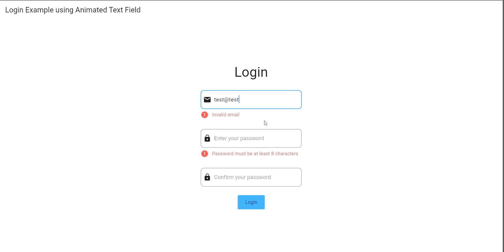
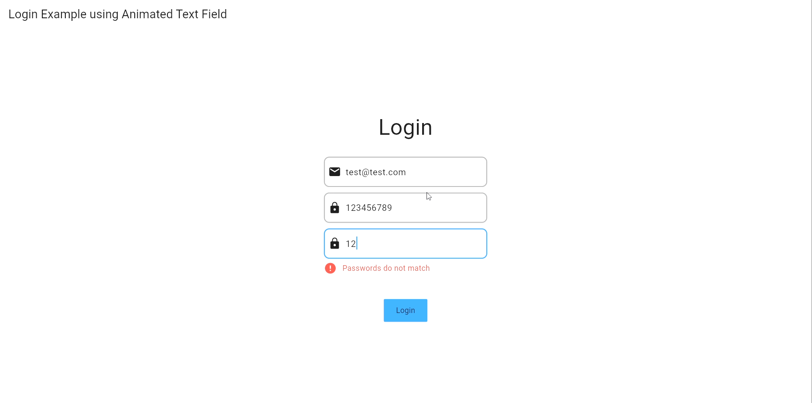

Animated Text Custom Field which can be used to animate text field and errors by modifying the text field widget.
It use custom fade animation from package [simple_animations](https://pub.dev/packages/simple_animations) to animate the text field and errors and hide error after interval of time (default 10 seconds).


## Features
- Easy to handle errors
- Easy to handle text field
- Keep remove boilerplate code
- Some Validation are already added
    - Email
    - Password
    - Phone
    - Url


## Getting started
- Add the dependency to your pubspec.yaml file
  ``` 
    dependencies:
        animated_text_custom_field: ^0.0.1
    ```
- Import the package
    ```
        import 'package:animated_text_custom_field/animated_text_custom_field.dart';
    ```
- Use the widget
    ```
        CustomTextField(
                        errorKey: 'password',
                        controller: passwordController,
                        keyboardType: TextInputType.visiblePassword,
                        decoration: CustomTextInputDecoration(
                          prefixIcon: const Icon(Icons.lock),
                          hintText: "Enter your password",
                          enabledBorder: OutlineInputBorder(
                            borderRadius: BorderRadius.circular(10),
                            borderSide: const BorderSide(
                              color: Colors.grey,
                              width: 2,
                            ),
                          ),
                          border: OutlineInputBorder(
                            borderRadius: BorderRadius.circular(10),
                            borderSide: const BorderSide(
                              color: Colors.grey,
                              width: 2,
                            ),
                          ),
                          focusedBorder: OutlineInputBorder(
                            borderRadius: BorderRadius.circular(10),
                            borderSide: const BorderSide(
                              color: Colors.blue,
                              width: 2,
                            ),
                          ),
                        ),
                        validator: (String? value) {
                          if (value != null) {
                            if (!TextErrorservice.isValidPasswordLength(value,  //using TextErrorService to validate password 
                                length: 8)) {
                              return "Password must be at least 8 characters";
                            }
                          }
                          return null;
                        },
                      ),
    ```


## Usage

A simple usage example:
- open code folder "example" in code editor (VS Code, Android Studio, etc).
- run the following command in terminal
```
    flutter run -d chrome
```

## Output




